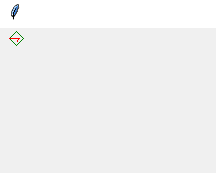
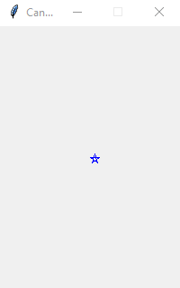
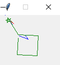
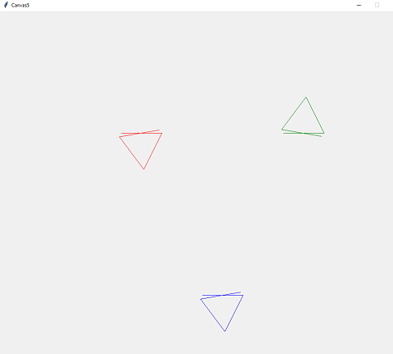
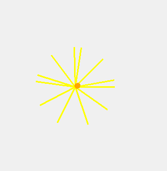
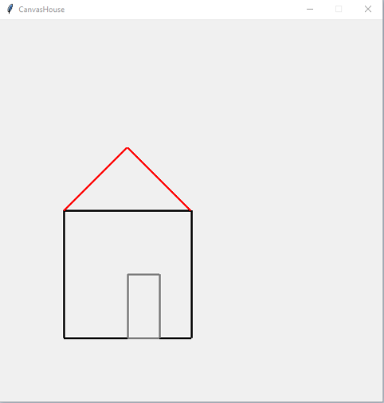
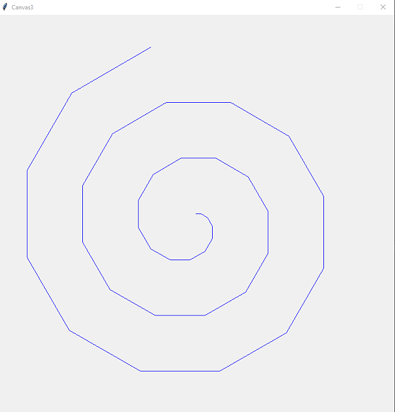
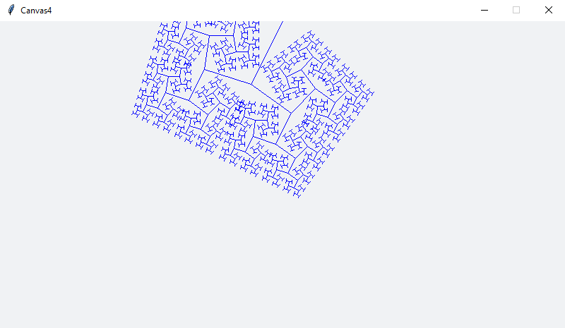
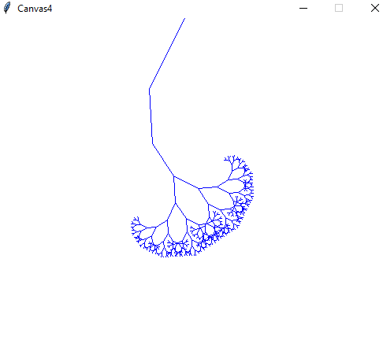

# Tema **PDraw**, grupo **pdraw-t06**
-----

## Constituição dos grupos e participação individual global

| NMec | Nome | Participação |
|:---:|:---|:---:|
| 108412 | ANDRÉ MIRAGAIA RODRIGUES | 14.2% |
| 107696 | GUILHERME CHAPELO ANDRADE | 14.2% |
| 107766 | GUILHERME FERREIRA DUARTE | 14.2% |
|  76763 | JOÃO EDUARDO SANTOS ALCATRÃO | 29.0% |
| 108214 | JOÃO PAULO HENRIQUES CAETANO RODRIGUES | 14.2% |
| 103325 | SAMUEL DA SILVA MATOS TEIXEIRA | 14.2% |

## Relatório

- Use esta secção para fazer um relatório sucinto mas explicativo dos objetivos concretizados.

## Gramática

### Estruturas

Na produção da gramática foram identificadas **14 Estruturas** principais que compõem a linguagem *pdraw*. 

1. `penTypeDef` Esta estrutura define um tipo de uma caneta, com vários atributos (cor, posição, orientação, espessura, pressão, up/down).

2. `penAssignment` Esta estrutura declara uma atribuição de uma caneta. Por defeito, a caneta vai desenhar no último canvas criado.

3. `penAction` Esta estrutura define uma ação de uma caneta (que pode ser forward, backward, left, right, up ou down).

4. `varAssignment` Esta estrutura define a atribuição de uma variável. O valor a atribuir tem de ser consistente com o tipo da variável.

5. `varDeclaration` Esta estrutura define a declaração de uma variável e do seu tipo.

6. `execution` Esta estrutura permite executar comandos da linguagem ipdraw.

7. `canvasDef` Esta estrutura declara a definição do Canvas. Por defeito, em cada programa é inicializado um canvas de dimensões (500,500), sem nome.

8. `print` Esta estrutura imprime no terminal o valor de uma varíavel ou uma string.

9. `penAlter` Esta estrutura permite definir alterações à caneta.

10. `pause` Esta estrutura define uma pausa, cujo valor deve ser expresso em microssegundos.

11. `if` Esta estrutura define uma declaração condicional.

12. `function_declaration` Esta estrutura refere-se à declaração de uma função, com 0 ou mais parâmetros (cada um tem que tem atribuído um tipo).

13. `canvas_select` Esta estrutura permite que uma pen desenhe no canvas indicado.

11. `until` Esta estrutura permite definir uma condição limite de execução.

12. `for_loop` Esta estrutura define um loop de execução com estado inicial e final.

13. `expr` Esta estrutura define uma expressão, que pode ser do tipo real, int, string, bool ou point.

14. `{` stat* `}` Esta estrutura é um compound de instruções. É particularmente util para os for_loops, untils e ifs.

15. `canvas_color`  Esta estrutura permite alterar a cor de um canvas.

### Tipos

A gramática compreende **5 tipos** de dados diferentes.

1. `int` Representa os números inteiros.

2. `real` Representa os números reais, ou seja, números com ponto flutuante.

3. `bool` Representa booleanos suportando duas palavras reservadas: `True` e `False`.

4. `string` Representa qualquer contéudo delimitado por `""`.

5. `point` Representa um ponto no plano, definido por duas expressões numéricas do tipo `real` ou `int`.

6. `pen` Representa as pens usadas para desenhar no plano. Este tipo é diferente dos restantes, pois cada pen tem os atributos color (cor), pos (posição), orientation (orientação), thickness (espessura) e pressure (pressão).

### Declarações

1. `penTypeDef` É responsável por declarar um novo tipo de caneta e das suas propriedades. Se estas forem omitidas, elas serão declaradas com os valores (0,0), 'red', 0, 1, 0, False para a posição, cor, orientação, espessura, pressão, e up/down, respetivamente.

2. `canvasDef` É responsável por declarar um novo canvas(tela) com propriedades de altura e largura.

3. `varDeclarations` É responsável por declarar 1 ou mais variáveis de um determinado tipo referido previamente.

4. `function_declaration` É responsável por declarar uma função, incluindo a declaração de duas variáveis dentro do corpo da função, juntamente com quaisquer parâmetros e o bloco de instruções da função.

5. `function` É responsável pela execução de uma função com a palavra-chave `functionador`, que aceita um nome de função e uma lista opcional de expressões com parâmetros cujos tipos têm de ser consistentes com os que foram declarados na function_declaration.

### Atribuições

1. `penAttribute` Define diferentes tipos de atributo para uma caneta. É usada para configurar propriedades de uma caneta, como cor, posição, orientação, espessura e pressão, que podem mais tarde ser alteradas com o `penAlter`. 

2. `penAlter` É responsável por definir como os atributos de uma caneta podem ser alterados.

3. `varAssignment` É responsável por atribuir valores a variáveis, é flexivel para atribuir valores a uma ou mais variaveis e o tipo é opcional.

4. `penAssignment` É responsável por uma atribuição de uma nova instância de uma caneta (que pode herdar algum tipo de caneta previamente definido com `penTypeDef`) a uma variável.

### Condicionais

1. `until` É uma forma de loop inverso em que o bloco de instruções é executado até que a condição seja verdadeira.

2. `for_loop` Contém um atribuição inicial, uma expressão condição e uma atribuição de incremento. O bloco de instruções(`stat`) é executado repetidamente enquanto a expressão de condição for verdadeira.

3. `if` é utilizado para executar um bloco de instruções (`stat`) condicionalmente, com base na avaliação de uma expressão condicional. 

### Expressões

Expressões geralmente representam construções que podem ser avaliadas para produzir um valor.

1. `Type` É utilizada para fazer a conversão de tipo explicita. Conversões para os tipos bool e point não são permitidas.

2. `Parêntisis` É utilizada para agrupar subexpressões e estabelecer uma ordem de avaliação.

3. `Operador de negação` representa a negação lógica de uma expressão booleana.

4. `AND` Representa operações lógicas `AND` entre duas expressões booleanas.

5. `OR | XOR` Representa operações lógicas `OR` e `XOR` entre duas expressões booleanas.

6. `Bool_comparison` Representa operações de comparação entre duas expressões.

7. `Operadores aritméticos: SUM` Representam operações aritméticas de soma e subtração entre duas expressões numéricas.

8. `Operadores aritméticos: MULT` Representam operações aritméticas de multiplicação e divisão entre duas expressões numéricas.

9. `StdIn`: Representa a entrada padrão de um programa, permitindo ao utilizador interagir com o programa, ela é seguida por uma ou mais strings que descrevem a entrada.

10. `Expression REAL` Expressões que representam números reais.

11. `Expression INT` Expressões que representam números inteiros.

12. `Point` Representa um ponto, formado por uma tupla com dois valores numéricos.

13. `ID` Representa o nome de uma variável.

14. `function` Representa a execução da função indicada com os parâmetros dados;

15. `Booleano` Representa valores booleanos: `True` e `False`.

16. `String` Representa uma sequência de caractéres fechada por `""`.

### Expressões Terminais

Na nossa gramática há 4 tipos de expressões terminais.

1. `Palavras chave` Palavras reservadas que têm significados especificos na linguagem (como 'position').

2. `Simbolos especiais` Caractéres especiais que têm funções especificas na linguagem (como o operador '+'.).

3. `Identificadores` Sequências de caractéres utilizadas para nomear variaveis, classes e outros elementos do programa.

4. `Literais` Valores constantes que aparecem diretamente no código-fonte. Podem ser números inteiros, reais, valores booleanos e strings (como 'blue').

## Gramática Secundária

### Estruturas

Na produção da gramática foram identificadas **8 Estruturas** principais que compõem a linguagem *pdraw*. 

1. `penCommand` Esta estrutura define um comando de uma caneta.

2. `if` Esta estrutura define uma condição.

3. `until` Esta estrutura define uma condição limite de execução.

4. `print` Esta estrutura define uma impressão.

5. `{` stat* `}` Esta estrutura é um compound de instruções. 

6. `varAssignment` Esta estrutura define a atribuição de uma variável.

7. `varDeclaration` Esta estrutura define a declaração de uma variável.

8. `pause` Esta estrutura define uma pausa.

9. `interactador` Esta estrutura define uma funcionalidade poderosa, que é permitir o utilizador interagir com o programa, não com strings, como permite o stdin, mas com comandos ipdraw. Isto permite o utilizador desenhar em live.

### Tipos

A gramática compreende **5 tipos** de dados diferentes.

1. `int` Representa os números inteiros.

2. `real` Representa os números reais,ou seja, números com ponto flutuante.

3. `bool` Representa booleanos suportando duas palavras reservadas: `True` e `False`.

4. `string` Representa qualquer contéudo delimitado por `""`.

5. `point` Representa um ponto no plano, definido por duas expressões numéricas do tipo `real` ou `int`.

### Declarações

1. `varDeclaration` É responsável por declarar variáveis de um determinado tipo referido previamente.

### Atribuições

1. `penCommand` Define diferentes tipos de comando para uma caneta. É usada para configurar propriedades de uma caneta, como cor, posição, orientação, espessura e pressão.

1. `varAssignment` É responsável por atribuir valores a variaveis, é flexivel para atribuir valores a uma ou mais variaveis e o tipo é opcional.

### Condicionais

1. `until` É uma forma de loop inverso em que o bloco de instruções é executado até que a condição seja verdadeira.

### Expressões

Expressões geralmente representam construções que podem ser avaliadas para produzir um valor.

1. `Parêntisis` É utilizada para agrupar subexpressões e estabelecer uma ordem de avaliação.

2. `Operador de negação` representa a negação lógica de uma expressão booleana.

3. `AND` Representa operações lógicas `AND` entre duas expressões booleanas.

4. `OR | XOR` Representa operações lógicas `OR` e `XOR` entre duas expressões booleanas.

5. `Bool_comparison` Representa operações de comparação entre duas expressões.

6. `Operadores aritméticos: MULT` Representam operações aritméticas de multiplicação e divisão entre duas expressões numéricas.

7. `Operadores aritméticos: SUM` Representam operações aritméticas de soma e subtração entre duas expressões numéricas.

8. `Expression REAL` Expressões que representam números reais.

9. `Expression INT` Expressões que representam números inteiros.

10. `Booleano` Representa valores booleanos: `True` e `False`.

11. `ID` Representa o nome de uma variável.

12. `Point` Representa um ponto, formado por uma tupla com dois valores numéricos.

13. `String` Representa uma sequência de caractéres fechada por `""`.

### Expressões Terminais

Na nossa gramática há 4 tipos de expressões terminais.

1. `Palavras chave` Palavras reservadas que têm significados especificos na linguagem.

2. `Simbolos especiais` Caractéres especiais que têm funções especificas na linguagem.

3. `Identificadores` Sequências de caractéres utilizadas para nomear variaveis, classes e outros elementos do programa.

4. `Literais` Valores constantes que aparecem diretamente no código-fonte. Podem ser números inteiros, reais, valores booleanos e strings.

## Análise Semântica

Foi criado um Visitor para a análise semântica que analisa o programa pdraw introduzido nela e verifica se o código tem sentido semântico, isto é, se as variáveis são do tipo correto no contexto em que se encontram, se as expressões são válidas e são compostas por valores corretos, se os parâmetros de funções a executar são consistentes com os parâmetros definidos na declaração de funções. Os visits retornam uma String. Na maior parte dos casos, se for retornada a string vazia, a análise semântica foi bem sucedida. Caso contrário, é escrito no stderr uma mensagem de error e o programa é terminado, incrementando o contador de erros.

A semântica inclui verificações como garantir que variáveis sejam declaradas antes de serem usadas, que os valores atribuídos a essas variáveis são consistentes com o tipo das mesmas, garantir que os tipos de variáveis correspondam aos tipos esperados nas operações, e assegurar que certas ações (como ações de caneta) sejam aplicáveis apenas a variáveis do tipo correto (nesse caso, variáveis do tipo "pen").

Além disso, há tratamento de erros, onde mensagens de erro são exibidas se uma condição específica não for atendida. Por exemplo, se uma expressão numérica for esperada, mas uma expressão booleana for fornecida, um erro é impresso na consola.

O código também lida com declarações e atribuições de variáveis, operações matemáticas, operações booleanas, entre outros. Todas estas operações são verificadas semanticamente para garantir que sejam válidas e consistentes com as regras da linguagem.

No geral, a semântica do código visa garantir que o programa seja estruturado corretamente e que as operações realizadas sejam logicamente consistentes, minimizando assim a ocorrência de erros durante a execução do programa.

### Dados guardados durante a análise semântica

Durante a análise semântica, são guardados os seguintes dados:

1. `Variáveis` São guardadas todas as variáveis declaradas e o seu tipo através de um dicionário (varTypes).

2. `Funções e parâmetros` São guardadas os nomes de todas as funções declaradas, bem como os tipos de todos os seus argumentos.

2. `Contador de Erros` É guardado um contador de erros para saber a quantidade de erros encontrados durante a análise semântica. Este contador é utilizado na main para detetar se existem erros e terminar o programa.

## Compilador

`ANTLR Parser Integration`: O compilador usa o ANTLR (ANTLR Parser Generator) para gerar um parser em Java para a linguagem de programação "pdraw" e, no caso da linguagem secundária, um parser em Python para a linguagem "ipdraw". Isso permite que o compilador analise e interprete o código-fonte escrito na linguagem "pdraw".

`Visitor Pattern`: No caso da linguagem primária, o compilador implementa uma série de classes que estendem pdrawBaseVisitor<ST>. Essas classes são responsáveis por percorrer a árvore sintática gerada pelo parser ANTLR e gerar a saída correspondente na forma de texto ST. São guardadas todas as variáveis declaradas e os valores que lhe são atribuídos, para que possam ser usadas nas várias funções do Compilador. Todo o código ST foi feito de modo a permitir que os placeholders fossem preenchidos pelos nomes, valores das variáveis e expressões usadas de modo a formarem código coerente em Python que fizesse o mesmo que os comandos do código fonte indicam. No caso de nomes de variáveis, nós acrescentamos um prefixo "var_" a cada uma de modo a que não fossem usadas palavras reservas de Python no programa de saída. 
No caso da linguagem secundária, o Compilador, escrito em Python, também funciona como Interpretador, e em cada função é feita a análise semântica e o processamento do código "ipdraw" em simultâneo. O Compilador não escreve texto ST, mas sim executa logo código Python, sendo assim "ipdraw" uma linguagem interpretada, e é executado no funcionamento do programa Python escrito pelo Compilador primário. Este Compilador recebe também ao início uma caneta e um canvas indicados no programa Python, e as ações feitas nestes elementos refletem-se em run-time no programa Python em execução. Com a regra `functionador`, esta interação é levada a outro nível, e é possível executar comandos "ipdraw" ao vivo, permitindo assim não só o desenho de programas já escritos, como também desenhar live.

`String Template`: O compilador primário utiliza o StringTemplate para gerar código de saída. Isso permite a criação de modelos de texto com espaços reservados que são preenchidos com dados durante o processo de compilação. Todo o código ST encontra-se em Python, sendo este o output da execução do Compilador, que só ocorre caso a análise semântica não retorne nenhum erro.

`Estrutura de Controle`: O compilador inclui regras para lidar com diferentes estruturas de controle, como declarações de variáveis, atribuições, loops (for, until), condicionais (if), etc.

`Manipulação de Canvas e Pen`: Há suporte para definição e manipulação de "canvas" e "pen", presumivelmente para desenhar gráficos ou figuras. O compilador acompanha os nomes dos canvas criados e associa cada caneta a um canvas específico.

`Manipulação de Funções`: O compilador suporta declaração e chamada de funções. Ele gera código para lidar com a definição de funções, bem como com a chamada delas.

`Tratamento de Erros`: O compilador inclui tratamento básico de erros, como mensagens de erro para casos em que o código-fonte não está em conformidade com a gramática esperada.

O compilador é responsável por transformar código-fonte escrito na linguagem "pdraw" em código de saída correspondente, que pode ser executado ou traduzido para outra forma de representação(como código de máquina).

## Caraterísticas avançadas
Além das caraterísticas mínimas e desejáveis pedidas, o programa também apresenta 2 caraterísticas avançadas, 1 para cada linguagem: a declaração e uso de funções (com sensibilidade a variáveis locais e contexto) para a linguagem "pdraw", e para a linguagem "ipdraw" apresenta-se a funcionalidade de inserir comandos live, tornando assim esta linguagem realmente interactive, com a funcionalidade de interação pura.
É assim possível desenhar ao vivo em "ipdraw" com o uso do comando `interactador`.

## Como correr
Pode-se executar o programa de qualquer uma destas alternativas:

1. Utilizar o comando no terminal "cat 'ficheiro .pdraw' | antlr4-run". O resultado é guardado em "pdraw_program.py".

2. Utilizar o comando no terminal "cat 'ficheiro .pdraw' | antlr4-run > 'ficheiro de saída .py'" e executar o ficheiro de saída subsequente. Por norma, utilizados "pdraw_program.py" como 'ficheiro de saída .py';

3. Correr o ficheiro bash "execute.sh", que irá compilar os programas exemplo p1.pdraw, p2.pdraw e p3.pdraw (que foram bastante alterados) e correr os programas criados pdraw_program.py, pdraw_program2.py, pdraw_program3.py.

## Resultados

## Contribuições

| NMec | Nome | Contribuições |
|:---:|:---|:---:|
| 108412 | ANDRÉ MIRAGAIA RODRIGUES | Compilador Primário, Testagem  |
| 107696 | GUILHERME CHAPELO ANDRADE | Análise Semântica, Relatório |
| 107766 | GUILHERME FERREIRA DUARTE | Análise Semântica, Testagem, Relatório |
|  76763 | JOÃO EDUARDO SANTOS ALCATRÃO | Gramática primária, Gramática Secundária, Análise Semântica, Compilador Primário, Código ST, Compilador e Interpretador secundários, Testagem, Relatório |
| 108214 | JOÃO PAULO HENRIQUES CAETANO RODRIGUES | Gramática primária, Gramática Secundária |
| 103325 | SAMUEL DA SILVA MATOS TEIXEIRA | Código ST, Análise Semântica, Testagem |
